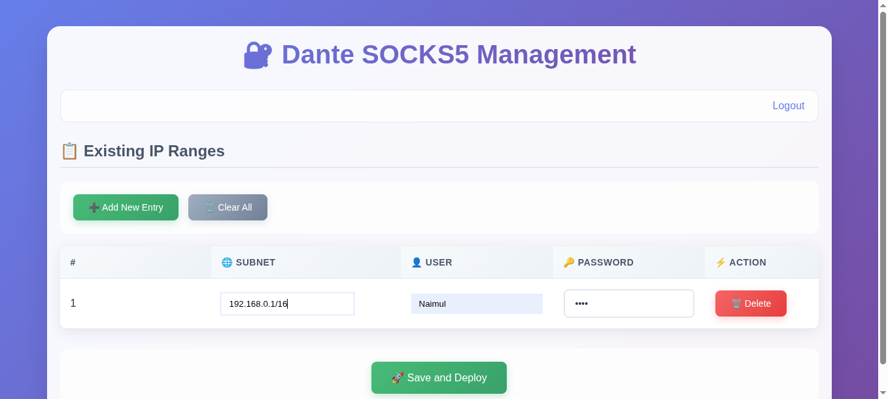
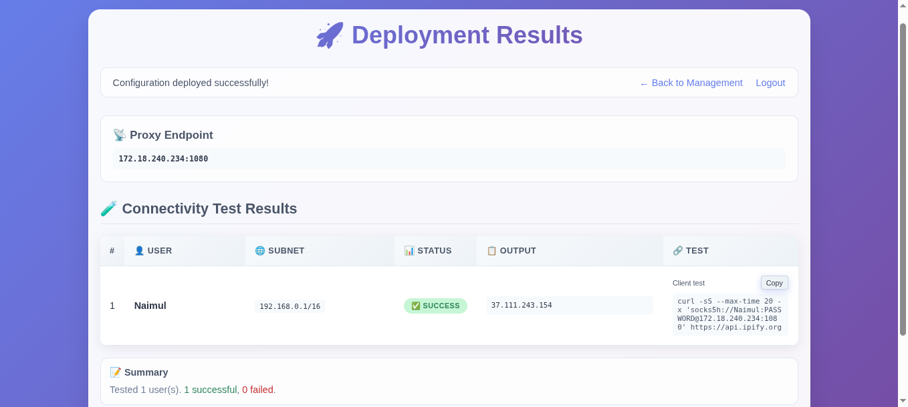

<div align="center">

<h1>Simple DantD UI</h1>

Manage your Dante SOCKS5 proxy with a clean, modern web interface.

<p>
  <a href="https://github.com/mdnaimul22/simple-dantd"></a>
  
  
  
</p>

<p>
  <a href="#quick-start">Quick Start</a> •
  <a href="#features">Features</a> •
  <a href="#screenshots">Screenshots</a> •
  <a href="#using-the-ui">Using the UI</a> •
  <a href="#environment-variables">Env</a> •
  <a href="#development">Development</a>
</p>

</div>

## Screenshots

<div align="center">



<p/>


<p/>



</div>

## Features

- 🔐 Admin login with username/password from `.env`
- 🌐 Manage allowed client subnets
- 👥 Create/update Linux users for Dante auth (group `danteproxy`)
- ⚙️ Safely write `danted.conf` and restart the service
- 🧪 Built-in connectivity test per user with ready-to-copy curl commands
- 🧾 Persists UI state in `/etc/dante-ui.json`

## Quick Start

1) Clone the repo

2) Create your `.env` and set admin credentials for the UI:

```bash
cp .env.example .env
# edit values
ADMIN_USER=admin
ADMIN_PASS=admin
```

3) Run the UI:

```bash
bash ./run.sh
```

This will:

- Ensure `127.0.0.50` is bound to loopback
- Create and activate a virtualenv `.venv/`
- Install dependencies
- Start the Flask UI at http://127.0.0.50:7000

4) Login using the admin credentials you set in `.env`.

## Using the UI

- Add rows for: subnet, user, password
- Click "Save and Deploy"
- You will be prompted for your sudo password (needed to write config, create users, restart service)
- After deploy, the UI tests connectivity per user and shows a sample curl command

## Prerequisites

- Linux with sudo access
- Dante server (danted) installed via your package manager
- Python 3.11+ (virtualenv is created by `run.sh`)

## Environment Variables

The UI reads these from the `.env` file:

- `ADMIN_USER` — UI login username
- `ADMIN_PASS` — UI login password

The Flask session secret is managed in code (can be overridden via `DANTE_UI_SECRET` env var if you really need to override it outside `.env`).

## Important Notes

- Writes state to `/etc/dante-ui.json` and manages `danted.conf` at `/etc/danted.conf`.
- Managed Linux group is `danteproxy`; proxy users are added to it.
- Default proxy port is `1080`.
- Network/service operations require sudo.

## Development

- Flask version is pinned in `webui/requirements.txt`. The UI server code lives in `webui/app.py`.
- Static assets and templates are under `webui/static/` and `webui/templates/`.

### Project Structure

```
simple-dantd/
├─ webui/
│  ├─ app.py               # Flask app
│  ├─ requirements.txt     # Python deps
│  ├─ static/style.css     # Styles
│  ├─ templates/           # HTML templates
│  └─ .asset/              # Screenshots (docs)
├─ .env.example            # Copy to .env and set admin creds
├─ .gitignore              # Ignore .venv, .env, caches
├─ run.sh                  # One-command dev runner
└─ README.md
```

## License

MIT
